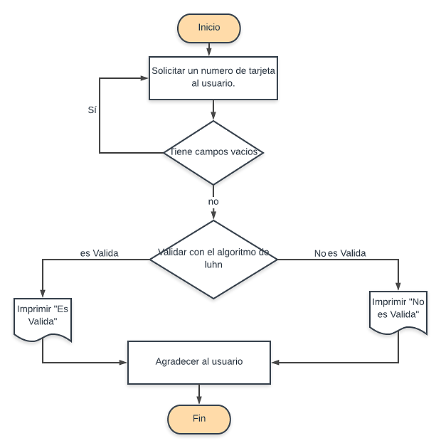

#  TARJETA DE CREDITO VALIDA

#### PLANTEAMIENTO:

###### Crearemos una web que pida un numero de tarjeta al usuario, para validarla conforme al algoritmo de Luhn.

###### Para esta caso en especial no permitiremos que el usuario ingrese  campos vacios.

#### PSEUDOCODIGO:
##### Descripcion.
###### En esta parte se decribe la funcionalidad del proyecto descrito en pasos simples.

1.- Se solicita al usuario el numero a evaluar.

2.- Se validaran los datos del usuario para evitar campos vacios.

3.- Por medio de la funcion isValidCard se determinara si el numero es valido.

5.- Se imprimira el resultado tanto si la tarjeta es valida como si no.

#### DIAGRAMA DE FLUJO :
##### Descripcion.
###### Este sera el flujo a seguir de nuestro programa

